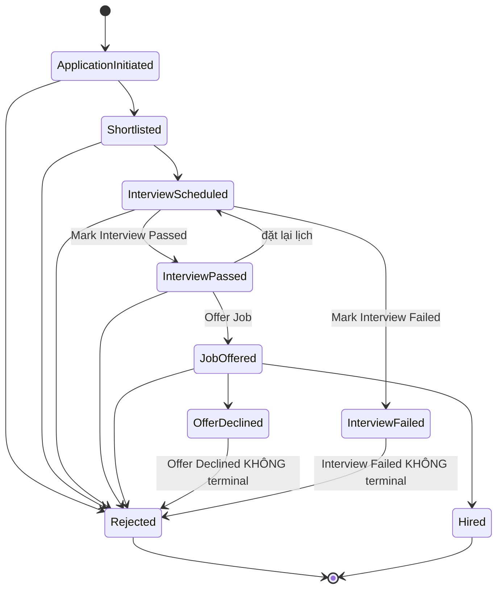

# TÀI LIỆU YÊU CẦU NGHIỆP VỤ (BRD/PRD) — MODULE RECRUITMENT
### Đặc tả AS-IS — reverse-engineered qua kiểm thử tự động (Playwright) trên hệ thống thật

| | |
|---|---|
| **Hệ thống tham chiếu** | OrangeHRM OS Demo — https://opensource-demo.orangehrmlive.com/web/index.php/ (OS 5.9) |
| **Phiên bản tài liệu** | v6.4 |
| **Ngày verify** | 11/07/2026 |
| **Phương pháp** | Tự động hoá UI + kiểm tra network response (HTTP status, error message thật) cho mọi action ghi/sửa/xoá — không suy đoán |
| **Trạng thái** | **100% mục nghiệp vụ đã verify — không còn gap** |

**Lịch sử:** v3.0 verify Vacancy delete/Attachment/Interview Passed-Failed → v4.0 verify trọn pipeline đến Hired, sửa rule Hiring Manager → v5.0 đóng gap phân quyền + Offer Declined + Number of Positions → v6.0 đóng gap decimal validation, rút gọn tài liệu → v6.1 đóng gap cuối cùng (action sau Interview Failed) → v6.2 gộp mục Actors + Phân quyền, bỏ mũi tên nối tiếp gây hiểu nhầm luồng ở danh sách Status → v6.3 bổ sung message lỗi chính xác (email format, resume type/size) và định dạng ngày yyyy-dd-mm — đối chiếu ngược từ 1 lần chạy `plan-tcs` Mode B độc lập (không đọc file này), phát hiện các fact BRD gốc còn thiếu → **v6.4** tìm ra root cause thật của lỗi 500 gặp phải trong nhiều lượt verify trước (rule #21: do Vacancy thiếu Hiring Manager, KHÔNG phải backend down ngẫu nhiên) — verify trực tiếp 4 state còn lại (Interview Passed, Job Offered, Offer Declined, Hired) bằng cách đổi sang Vacancy có Hiring Manager hợp lệ.

> Mọi hành vi ghi "verified" đều có bằng chứng network response và/hoặc screenshot trực tiếp. Môi trường là demo public dùng chung, backend đôi khi trả lỗi 500 tạm thời trên action ghi dữ liệu — không phải lỗi từ phía kiểm thử; các trường hợp này được ghi rõ thay vì bỏ qua.

---

## 1. MỤC ĐÍCH SỬ DỤNG

Tài liệu là bản đặc tả AS-IS dựng lại từ hành vi hệ thống thật (không có BRD gốc), dùng làm **ground truth cho lập kế hoạch test case**. Mỗi User Story có mã (`REC-1xx`…) để trace ngược khi sinh test case. Mục 8 (Business Rules) là nguồn chính cho test case negative/edge. Mục 9 (Không có trong scope) liệt kê hành vi *tưởng có nhưng thực tế không có* — tránh AI/QA tự sinh test case cho tính năng không tồn tại.

---

## 2. PHẠM VI

Module gồm 2 tab: **Candidates** và **Vacancies**. Không có Dashboard riêng, không có Kanban board.

Đã verify đầy đủ: CRUD Vacancy (kèm Attachments), CRUD Candidate, Public Apply Form, toàn bộ **8/8 stage action** trong Candidate Pipeline, và các business rule ẩn (unique/required constraint, duplicate-check, field lock, overlap validation, phân quyền).

---

## 3. GLOSSARY

| Thuật ngữ | Định nghĩa |
|---|---|
| Vacancy | Vị trí tuyển dụng, gắn 1 Job Title + 1 Hiring Manager, có thể publish công khai |
| Job Title | Chức danh dùng chung, tham chiếu danh mục Admin > Job Titles |
| Hiring Manager / Interviewer | Chỉ là field dữ liệu tham chiếu **Employee** — **không phải role hệ thống** (xem mục 4) |
| Candidate | Hồ sơ ứng viên, di chuyển qua Candidate Pipeline theo Status |
| Candidate Pipeline | Chuỗi Status của 1 Candidate. Chỉ `Rejected` và `Hired` là terminal thật; `Offer Declined` và `Interview Failed` đều KHÔNG terminal — vẫn cho phép `Reject` |
| Stage Action | Hành động đổi Status (Shortlist, Reject…), luôn mở form: Candidate/Vacancy/Hiring Manager/Current Status/Notes + Cancel/Save |
| ESS | Employee Self Service — 1 trong 2 role hệ thống, không có quyền vào Recruitment |

---

## 4. ACTORS & PHÂN QUYỀN

Hệ thống chỉ có 2 role (Admin > User Management > Add User): `Admin`, `ESS`. **Không tồn tại role "Hiring Manager"/"Interviewer"** — 2 field này trên form Vacancy/Schedule Interview chỉ tham chiếu Employee, không liên quan quyền tài khoản.

| Actor | Quyền hạn |
|---|---|
| Role `Admin` | Toàn quyền Recruitment: CRUD Vacancy/Candidate, mọi stage action |
| Role `ESS` | KHÔNG có quyền vào Recruitment — chặn cả menu lẫn route-level (truy cập URL trực tiếp → "Credential Required") |
| Candidate (khách, không đăng nhập) | Xem jobs.html, nộp hồ sơ qua Public Apply Form |

*(Bằng chứng chi tiết: xem REC-501, REC-502 ở mục 6.)* Khi sinh test case phân quyền, chỉ dùng 2 role thật Admin/ESS — không tạo test case "đăng nhập role Hiring Manager".

---

## 5. CANDIDATE PIPELINE

### 5.1. Danh sách Status (9 status, liệt kê theo dropdown — KHÔNG phải luồng tuần tự cố định, xem luồng thật ở mục 5.3)

`Application Initiated`, `Shortlisted`, `Rejected`, `Interview Scheduled`, `Interview Passed`, `Interview Failed`, `Job Offered`, `Offer Declined`, `Hired`

### 5.2. Action theo Status hiện tại

| Status | Action khả dụng |
|---|---|
| Application Initiated | `Shortlist`, `Reject` |
| Shortlisted | `Schedule Interview`, `Reject` |
| Interview Scheduled | `Reject`, `Mark Interview Failed`, `Mark Interview Passed` |
| Interview Passed | `Reject`, `Schedule Interview` (đặt lại lịch), `Offer Job` |
| Interview Failed | `Reject` — **không phải trạng thái cuối** |
| Job Offered | `Reject`, `Offer Declined`, `Hire` |
| Offer Declined | `Reject` — **không phải trạng thái cuối** |
| Hired | *(không action)* — trạng thái cuối thật sự |

### 5.3. Sơ đồ trạng thái (luồng thật, có nhánh)



---

## 6. USER STORY

### Vacancy

#### REC-101: Danh sách Vacancy
```
Given Recruitment > Vacancies
Then có: filter (Job Title, Vacancy, Hiring Manager, Status), nút Add, bảng (Vacancy,
     Job Title, Hiring Manager, Status, Actions)
And KHÔNG có cột Total Candidates / Active-Applied count / nút View Candidates
```

#### REC-102: Tạo Vacancy
```
Given Recruitment > Vacancies > Add
Then form: Vacancy Name*, Job Title*, Description, Hiring Manager*, Number of Positions,
     toggle Active, toggle "Publish in RSS Feed and Web Page" (bật → hiện RSS Feed URL,
     Web Page URL, VD .../recruitmentApply/jobs.rss và /jobs.html)
And Vacancy Name PHẢI unique — trùng tên (kể cả vacancy inactive) → lỗi "Already exists"
And Hiring Manager bắt buộc, phải chọn từ autocomplete Employee — gõ tự do không chọn
     → lỗi "Invalid" (không phải "Required")
And Number of Positions optional, nhưng nếu điền: phải là số NGUYÊN 1–99
     - chữ/âm/thập phân (VD "abc", "-5", "1.5") → "Should be a numeric value"
     - 0 hoặc ngoài khoảng 1–99 → "Should be a number between 1-99"
And Job Title KHÔNG bị khoá dù Vacancy đã có candidate liên kết — vẫn đổi được bình thường
```

#### REC-103: Sửa Vacancy + Attachments
```
Given mở 1 Vacancy ở Edit
Then form giống Add Vacancy, thêm khối Attachments (File Name, File Size, File Type,
     Comment, Actions)
And nút Add trong Attachments mở "Add Attachment": Select File* (giới hạn 1MB), Comment,
     2 button Cancel/Save
```

#### REC-104: Xoá Vacancy
```
Given bấm xoá 1 Vacancy
Then popup "Are you Sure?" — "The selected record will be permanently deleted..." —
     "No, Cancel" / "Yes, Delete"
And permanent delete, KHÔNG bị chặn dù còn candidate liên kết (verified: xoá vacancy đang
     có 2 candidate active → API trả HTTP 200, "Successfully Deleted")
And candidate từng gắn vacancy đó hiển thị cột Vacancy = "(Deleted)" sau khi xoá
```

### Candidate

#### REC-201: Danh sách Candidate
```
Given Recruitment > Candidates
Then filter: Job Title, Vacancy, Hiring Manager, Status, Candidate Name, Keywords,
     Date of Application, Method of Application (Manual/Online)
And bảng: Vacancy, Candidate, Hiring Manager, Date of Application, Status, Actions
And action theo dòng: mở profile, xoá, download resume/attachment (nếu có)
```

#### REC-202: Xoá Candidate
```
Given bấm xoá 1 Candidate
Then popup xác nhận giống REC-104, permanent delete (không phải soft-delete)
```

#### REC-203: Thêm Candidate (form nội bộ)
```
Given Recruitment > Candidates > Add
Then form: First/Middle/Last Name (thuộc Full Name*, Last Name không có * riêng),
     Vacancy (optional), Email*, Contact Number, Resume (optional, .docx/.doc/.odt/
     .pdf/.rtf/.txt ≤1MB), Keywords, Date of Application (mặc định hôm nay), Notes,
     checkbox Consent to keep data
And KHÔNG có duplicate-check theo email — tạo được nhiều candidate cùng email
And field required để trống → lỗi "Required" (generic, đồng nhất mọi form trong module)
And Email sai định dạng (không đúng dạng x@y.z) → lỗi "Expected format: admin@example.com"
    (verified 2026-07-11 qua live exploration độc lập)
And Resume validate NGAY khi chọn file — client-side, trước khi bấm Save, KHÔNG có network
    request nào được gửi (verified 2026-07-11):
  - Sai định dạng → "File type not allowed"
  - Vượt quá 1MB → "Attachment Size Exceeded"
And Date of Application và Candidate History "Performed Date" hiển thị theo định dạng
    yyyy-dd-mm (ngày trước tháng — KHÔNG phải yyyy-mm-dd chuẩn ISO), verified 2026-07-11
And Candidate History ghi theo mẫu câu tự nhiên, ví dụ: "<user> added <candidate full name>",
    "<user> assigned the job vacancy <vacancy name>" — verified 2026-07-11
```

#### REC-204: Xem Candidate Profile
```
Given mở 1 candidate
Then 3 khối: (1) Application Stage — Name/Vacancy/Hiring Manager/Status/action button;
     (2) Candidate Profile — đầy đủ field + toggle Edit; (3) Candidate History — bảng
     Performed Date/Description/Actions
And History ghi đủ mọi event pipeline dạng câu tự nhiên "<user> <action> for <vacancy>"
```

#### REC-205: Sửa Candidate Profile
```
Given bật toggle Edit trong Candidate Profile
Then First/Middle/Last Name, Job Vacancy, Email, Contact Number, Keywords,
     Date of Application, Notes, Consent chuyển sang editable; Resume sang file-edit
And khối chỉ còn nút Save — KHÔNG có Cancel riêng
```

### Public Apply Form

#### REC-301: Danh sách Vacancy công khai
```
Given truy cập .../recruitmentApply/jobs.html không cần đăng nhập
Then danh sách vacancy publish, mỗi dòng: tên vacancy + nút Apply
And KHÔNG hiện slot còn lại / hired count
```

#### REC-302: Nộp hồ sơ public
```
Given bấm Apply trên 1 vacancy
Then trang "Apply for <Vacancy Name>": First/Middle/Last Name, Email*, Contact Number,
     Resume* (BẮT BUỘC — khác form nội bộ), Keywords, Notes, Consent to keep data
And 2 button Back/Submit; Resume cùng định dạng/giới hạn 1MB như form nội bộ
And KHÔNG có custom question, KHÔNG có ô paste-text resume
```

### Candidate Pipeline — Stage Action

Cả 8 action dùng chung pattern: Candidate/Vacancy/Hiring Manager/Current Status (read-only) + Notes + Cancel/Save.

| ID | Action | Pre-condition | Kết quả |
|---|---|---|---|
| REC-401 | Shortlist | Application Initiated | → Shortlisted |
| REC-402 | Reject | Application Initiated, Shortlisted, Interview Scheduled, Interview Passed, Job Offered | → Rejected (không có dropdown Reject Reason) |
| REC-403 | Schedule Interview | Shortlisted, Interview Passed | → Interview Scheduled. Form thêm: Interview Title*, Interviewer* (autocomplete Employee, nút Add Another), Date* (calendar), Time (KHÔNG bắt buộc). KHÔNG validate overlap lịch — double-booking cùng interviewer/ngày/giờ vẫn lưu được |
| REC-404 | Mark Interview Passed | Interview Scheduled | → Interview Passed |
| REC-405 | Mark Interview Failed | Interview Scheduled | → Interview Failed (không terminal, vẫn còn Reject) |
| REC-406 | Offer Job | Interview Passed | → Job Offered |
| REC-407 | Offer Declined | Job Offered | → Offer Declined (KHÔNG terminal, vẫn còn Reject) |
| REC-408 | Hire | Job Offered | → Hired (terminal thật sự, hết mọi action) |

**⚠️ Precondition ẩn cho REC-401/402/404/405** (xem rule #21): cả 4 action này chỉ hoạt động đúng nếu Vacancy của candidate có Hiring Manager hợp lệ (khác N/A). Khi tạo test data cho bất kỳ test case pipeline nào, luôn chọn Vacancy đã có Hiring Manager — nếu không sẽ gặp HTTP 500 do defect của hệ thống, không phải lỗi test.

### Phân quyền

#### REC-501: Mô hình role hệ thống
```
Given Admin > User Management > Add User
Then dropdown User Role chỉ có 2 giá trị: Admin, ESS
```

#### REC-502: Kiểm soát truy cập Recruitment
```
Given đăng nhập role ESS
Then không thấy menu Recruitment, truy cập URL trực tiếp → "Credential Required"
```

---

## 7. FIELD-LEVEL SPEC

### Add/Edit Vacancy

| Field | Required | Ghi chú |
|---|---|---|
| Vacancy Name | * | Unique toàn hệ thống |
| Job Title | * | Không khoá dù đã có candidate |
| Hiring Manager | * | Field dữ liệu (Employee), không phải role |
| Number of Positions | Không | Nếu điền: số nguyên 1–99 |
| Description | Không | |
| Active / Publish RSS+Web | Toggle | Mặc định bật |
| Add Attachment | Select File* | + Comment, ≤1MB |

### Add Candidate (nội bộ)

| Field | Required | Ghi chú |
|---|---|---|
| First/Last Name | * (nhóm Full Name) | |
| Email | * | Không duplicate-check. Sai format → "Expected format: admin@example.com" |
| Resume | Không | .docx/.doc/.odt/.pdf/.rtf/.txt ≤1MB. Validate client-side ngay khi chọn file (không cần Save): sai định dạng → "File type not allowed"; quá 1MB → "Attachment Size Exceeded" |
| Vacancy, Middle Name, Contact Number, Keywords, Notes | Không | |
| Date of Application | — | Mặc định hôm nay. Hiển thị dạng yyyy-dd-mm (không phải ISO yyyy-mm-dd) |

### Public Apply Form

Giống Add Candidate, khác duy nhất: **Resume bắt buộc (*)**.

### Schedule Interview

| Field | Required |
|---|---|
| Interview Title, Interviewer, Date | * |
| Time | Không |

### Edit Candidate Profile

Editable: First/Middle/Last Name, Job Vacancy, Email, Contact Number, Keywords, Date of Application, Notes, Consent, Resume (file-edit). Chỉ có nút Save, không có Cancel.

---

## 8. BUSINESS RULES ĐÃ VERIFY

| # | Rule | Tác động khi lập test case |
|---|---|---|
| 1 | Xoá Candidate/Vacancy = permanent delete | Negative test: không thể restore |
| 2 | Resume .docx/.doc/.odt/.pdf/.rtf/.txt ≤1MB — áp dụng cả internal form, public form, Add Attachment | Boundary test file size/format |
| 3 | Resume bắt buộc trên public form, optional trên internal form | Tách test case required theo từng form |
| 4 | Reject không có Reject Reason dropdown | Không cần test case cho field này |
| 5 | Bảng Vacancy / public jobs list không hiện số liệu candidate/slot/hired count | — |
| 6 | Reject khả dụng ở 5 status (Application Initiated, Shortlisted, Interview Scheduled, Interview Passed, Job Offered) | Test case Reject cần cover đủ 5 pre-condition |
| 7 | Xoá Vacancy KHÔNG bị chặn dù còn candidate liên kết | Rủi ro dữ liệu mồ côi — test case xác nhận candidate hiện "(Deleted)" |
| 8 | KHÔNG duplicate-check email khi thêm Candidate | Test case xác nhận đây là hành vi mong đợi, tránh báo nhầm defect |
| 9 | Vacancy Name PHẢI unique — lỗi "Already exists" | Test case unique + boundary (case-sensitivity chưa verify) |
| 10 | Job Title trên Vacancy KHÔNG bị khoá dù có candidate | Test case xác nhận đổi Job Title không phá liên kết candidate |
| 11 | Time trên Schedule Interview KHÔNG bắt buộc | — |
| 12 | KHÔNG validate overlap lịch giữa các Interview cùng 1 Interviewer | Rủi ro nghiệp vụ — test case double-booking mức ưu tiên thấp |
| 13 | Message lỗi required là "Required" — generic, đồng nhất mọi form | Test case error-message không cần assert riêng theo field |
| 14 | Hiring Manager là field BẮT BUỘC, chọn từ autocomplete — gõ tự do → "Invalid" | Test case required + test case "chọn sai/không chọn từ gợi ý" |
| 15 | Number of Positions: optional, nếu điền phải nguyên 1–99 (âm/chữ/thập phân/0/>99 đều lỗi) | Test case boundary: 0, 1, 99, 100, -1, "abc", "1.5" |
| 16 | Offer Declined KHÔNG terminal — vẫn cho Reject | Test case chain: Job Offered → Offer Declined → Reject |
| 17 | Module Recruitment Admin-only — ESS bị chặn cả menu và route-level | Test case phân quyền: xác nhận chặn truy cập mọi route `/recruitment/*` với tài khoản non-Admin |
| 18 | Interview Failed KHÔNG terminal — vẫn cho Reject (cùng pattern với Offer Declined) | Test case chain: Interview Scheduled → Interview Failed → Reject |
| 19 | Resume trên Add Candidate validate client-side ngay khi chọn file (sai định dạng "File type not allowed", quá 1MB "Attachment Size Exceeded") — KHÔNG cần bấm Save, KHÔNG có network request | Test case boundary không cần mock network — có thể verify hoàn toàn qua UI state |
| 20 | Date of Application / Candidate History hiển thị định dạng yyyy-dd-mm (ngày trước tháng), không phải ISO yyyy-mm-dd | Test case cần so khớp đúng format này, tránh assert sai định dạng ngày phổ biến hơn |
| 21 | **[DEFECT — không phải rule mong đợi] 4 action đổi status đơn giản (`Shortlist`, `Reject`, `Mark Interview Passed`, `Mark Interview Failed`) trả về HTTP 500 "Unexpected Error Occurred" nếu Vacancy của candidate đó có Hiring Manager = N/A (rỗng)** — verified bằng thực nghiệm: cùng thao tác, cùng candidate mới tạo, chỉ đổi Vacancy từ "Software Engineer" (Hiring Manager N/A) sang "Payroll Administrator" (Hiring Manager = "manda akhil user") thì chuyển từ 500 → 200 ngay lập tức, lặp lại nhất quán qua toàn bộ pipeline (Shortlist → Schedule Interview → Mark Interview Passed → Offer Job → Hire/Offer Declined, tất cả đều pass khi Hiring Manager có giá trị) | Test case: (a) xác nhận stage action FAIL khi Vacancy thiếu Hiring Manager — đây là defect nên báo cho dev, không phải business rule cần support; (b) khi tạo test data cho pipeline test, LUÔN chọn Vacancy có Hiring Manager hợp lệ để tránh false-negative do bug này, không phải do logic test sai |

---

## 9. KHÔNG CÓ TRONG SCOPE (verified KHÔNG tồn tại)

- Kanban board pipeline, tab Dashboard/Reporting riêng
- Cột Total Candidates / nút View Candidates trên bảng Vacancy
- Dropdown Reject Reason
- Custom question / paste-text resume trên form public
- Slot còn lại / hired count trên trang public jobs
- Role hệ thống "Hiring Manager"/"Interviewer" (chỉ là field dữ liệu)
- Block xoá Vacancy khi còn candidate liên kết
- Duplicate-check email khi thêm Candidate
- Validate overlap lịch phỏng vấn
- Khoá field Job Title khi Vacancy có candidate
- Cancel button trong Edit Candidate Profile
- Message lỗi field-specific khi required
- Trạng thái terminal ngay sau Offer Declined hoặc Interview Failed (cả 2 vẫn cho phép Reject)

---